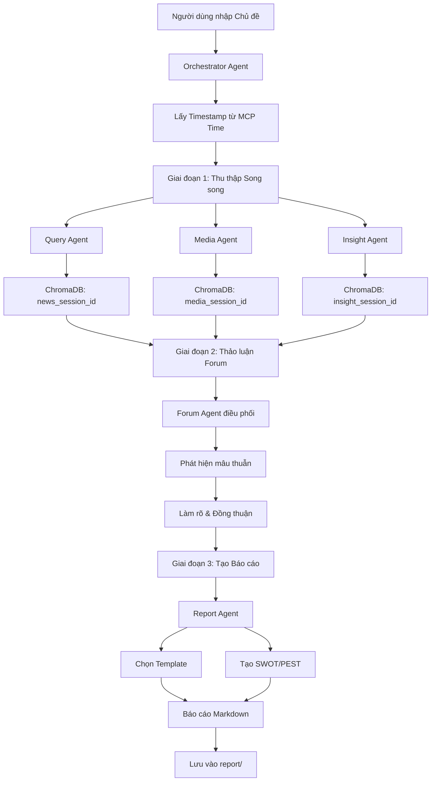

# 🐠 NoLine - Hệ thống Phân tích Dư luận Đa Agent

**NoLine** là một hệ thống phân tích dư luận và tình báo thị trường tiên tiến, sử dụng kiến trúc **Đa Tác nhân (Multi-Agent System)** dựa trên **GitHub Copilot Agents** và **MCP Servers** để mô phỏng quy trình làm việc của một nhóm chuyên gia phân tích thực thụ.

---

## ✨ Tính năng nổi bật

- 🤖 **6 Agent AI chuyên biệt**: Orchestrator + 5 Agent chuyên gia
- 🔍 **Phân tích đa chiều**: Tin tức, Media, và Cảm xúc xã hội
- 🎤 **Thảo luận tự động**: Các agent tranh luận và bổ sung cho nhau
- 📊 **Báo cáo tự động**: Xuất Markdown với biểu đồ tương tác
- 🧠 **Phân tích SWOT/PEST**: Công cụ phân tích chuyên sâu
- 💾 **Lưu trữ đa nền tảng**: ChromaDB (Vector), SQLite (SQL), Memory (Knowledge Graph)
- ⏰ **Timestamps thời gian thực**: Sử dụng MCP Time để đánh dấu thời điểm thu thập dữ liệu

---

## 📦 Yêu cầu hệ thống

| Yêu cầu            | Chi tiết                             |
| ------------------ | ------------------------------------ |
| **VS Code**        | Phiên bản mới nhất                   |
| **GitHub Copilot** | Premium (hỗ trợ Copilot Chat Agents) |
| **Docker**         | Để chạy các MCP servers              |
| **Extension**      | `ms-azuretools.vscode-docker`        |

---

## 🏗️ Kiến trúc Hệ thống

```
┌─────────────────────────────────────────────────────────────────┐
│                    🎯 ORCHESTRATOR AGENT                         │
│              (Điều phối toàn bộ workflow & agents)               │
└─────────────────────────────────────────────────────────────────┘
                                │
        ┌───────────────────────┼───────────────────────┐
        │                       │                       │
        ▼                       ▼                       ▼
┌───────────────┐     ┌───────────────┐     ┌───────────────┐
│ 🏛️ Query      │     │ 🎨 Media      │     │ 🧠 Insight    │
│    Agent      │     │    Agent      │     │    Agent      │
│               │     │               │     │               │
│ Nhà báo       │     │ Chuyên gia    │     │ Chuyên gia    │
│ điều tra      │     │ Đa phương tiện│     │ Tâm lý xã hội │
└───────────────┘     └───────────────┘     └───────────────┘
        │                       │                       │
        └───────────────────────┼───────────────────────┘
                                │
                                ▼
                    ┌───────────────────┐
                    │ 🎤 Forum Agent    │
                    │                   │
                    │ Người điều phối   │
                    │ thảo luận         │
                    └───────────────────┘
                                │
                                ▼
                    ┌───────────────────┐
                    │ 📝 Report Agent   │
                    │                   │
                    │ Tổng biên tập     │
                    │ tạo báo cáo       │
                    └───────────────────┘
                                │
                                ▼
                    ┌─────────────────────┐
                    │ 📄 Markdown Report  │
                    │  (report/*.md)      │
                    └─────────────────────┘
```

### 6 Agents chính

| Agent                     | Vai trò                 | Nhiệm vụ                                               |
| ------------------------- | ----------------------- | ------------------------------------------------------ |
| 🎯 **Orchestrator Agent** | Tổng chỉ huy            | Điều phối workflow, tạo session, phân công nhiệm vụ    |
| 🏛️ **Query Agent**        | Nhà báo điều tra        | Tìm kiếm tin tức, xác minh sự thật, xây dựng timeline  |
| 🎨 **Media Agent**        | Chuyên gia truyền thông | Phân tích hình ảnh, video, meme, viral content         |
| 🧠 **Insight Agent**      | Nhà nghiên cứu dư luận  | Phân tích cảm xúc MXH, slang, tâm lý đám đông          |
| 🎤 **Forum Agent**        | Người điều phối         | Tổ chức thảo luận, phát hiện mâu thuẫn, tìm consensus  |
| 📝 **Report Agent**       | Tổng biên tập           | Tổng hợp và tạo báo cáo Markdown vào thư mục `report/` |

---

## 🛠️ MCP Servers

Hệ thống sử dụng các MCP (Model Context Protocol) servers chạy qua Docker:

| MCP Server              | Chức năng                                          | Port   |
| ----------------------- | -------------------------------------------------- | ------ |
| **ChromaDB**            | Vector database - lưu trữ embeddings phân tích     | `8000` |
| **Memory**              | Knowledge Graph - lưu entities & relationships     | `3001` |
| **Sequential Thinking** | Reasoning engine - hỗ trợ suy luận nhiều bước      | `3002` |
| **Time**                | Timezone service - lấy timestamp cho data tracking | `3003` |
| **SQLite**              | SQL database - lưu insights và audit logs          | `3004` |

### Cấu hình MCP

MCP servers được cấu hình trong `.vscode/mcp.json`:

```jsonc
{
  "servers": {
    "chroma": { ... },      // Vector embeddings
    "memory": { ... },      // Knowledge graph
    "sequentialthinking": { ... },  // Multi-step reasoning
    "time": { ... },        // Timestamp service
    "SQLite": { ... }       // SQL storage
  }
}
```

---

## 🚀 Cài đặt & Sử dụng

### 1. Clone repository

```bash
git clone https://github.com/your-org/noline.git
cd noline
```

### 2. Cài đặt extension VS Code

Mở VS Code và cài đặt extension `ms-azuretools.vscode-docker`.

### 3. Khởi động MCP Servers

```bash
docker-compose up -d
```

### 4. Sử dụng trong VS Code

Mở Copilot Chat và gọi agent:

```
@orchestrator Phân tích xu hướng thị trường việc làm IT Việt Nam 2026
```

Hoặc gọi từng agent riêng lẻ:

```
@query-agent Tìm tin tức về AI tại Việt Nam
@media-agent Phân tích meme về công nghệ
@insight-agent Phân tích cảm xúc cộng đồng về startup
```

---

## 🔧 Quy trình Hoạt động (Workflow)



### 4 Giai đoạn chính

| Phase | Tên                    | Mô tả                                                       |
| ----- | ---------------------- | ----------------------------------------------------------- |
| 0     | **Khởi tạo**           | Tạo session_id với timestamp, khởi tạo ChromaDB collections |
| 1     | **Thu thập song song** | Query, Media, Insight agents thu thập dữ liệu đồng thời     |
| 2     | **Thảo luận Forum**    | Forum Agent điều phối thảo luận, tìm consensus              |
| 3     | **Tạo báo cáo**        | Report Agent tổng hợp và xuất file Markdown                 |

---

## ⏰ Timestamps & Data Freshness

Các agent thu thập dữ liệu sử dụng `mcp_time_get_current_time` để:

- Đánh dấu thời điểm thu thập dữ liệu
- Tạo `session_id` duy nhất (format: `BF-YYYY-MM-DD-XXX`)
- Lưu metadata thời gian vào ChromaDB để biết dữ liệu mới hay cũ
- Đặt tên file báo cáo với timestamp: `report/{topic}_{YYYY-MM-DD}_{HH-MM}.md`

---

## 📊 Mẫu Báo cáo

NoLine tự động chọn mẫu báo cáo phù hợp dựa trên nội dung phân tích:

| Mẫu           | Mô tả                 | Use case                     |
| ------------- | --------------------- | ---------------------------- |
| 🔥 Crisis     | Phân tích khủng hoảng | Sự cố, scandal, PR crisis    |
| 🏷️ Brand      | Sức khỏe thương hiệu  | Brand monitoring, perception |
| 📈 Trend      | Xu hướng thị trường   | Market trends, forecasting   |
| 📅 Event      | Tổng hợp sự kiện      | News events, launches        |
| ⚔️ Competitor | Phân tích đối thủ     | Competitive analysis         |
| 🌍 Market     | Tổng quan thị trường  | Market research              |

---

## 📁 Cấu trúc Dự án

```
noline/
├── .github/
│   └── agents/                    # Định nghĩa các Copilot Agents
│       ├── orchestrator.agent.md  # Tổng chỉ huy
│       ├── query.agent.md         # Nhà báo điều tra
│       ├── media.agent.md         # Chuyên gia media
│       ├── insight.agent.md       # Chuyên gia tâm lý
│       ├── forum.agent.md         # Điều phối thảo luận
│       └── report.agent.md        # Tổng biên tập
├── .vscode/
│   ├── mcp.json                   # Cấu hình MCP servers
│   ├── settings.json              # VS Code settings
│   └── extension.json             # Recommended extensions
├── report/                        # Thư mục chứa báo cáo output
│   └── *.md                       # Các báo cáo Markdown
├── docker-compose.yml             # Docker services cho MCP
└── README.md
```

---

## 🗄️ Data Storage

| Storage      | Loại            | Nội dung                                  |
| ------------ | --------------- | ----------------------------------------- |
| **ChromaDB** | Vector Database | Embeddings từ news, media, insight, forum |
| **Memory**   | Knowledge Graph | Entities & relationships của topics       |
| **SQLite**   | SQL Database    | Insights log, audit trail                 |
| **report/**  | File System     | Báo cáo Markdown output                   |

---

## 🙏 Credits

- Built with ❤️ by NoLine Team
- Powered by GitHub Copilot Agents & MCP Protocol

---

<div align="center">

🐠 **NoLine** - Multi-Agent Public Opinion Analysis System

Made with ❤️ in 🇻🇳 Vietnam

</div>
