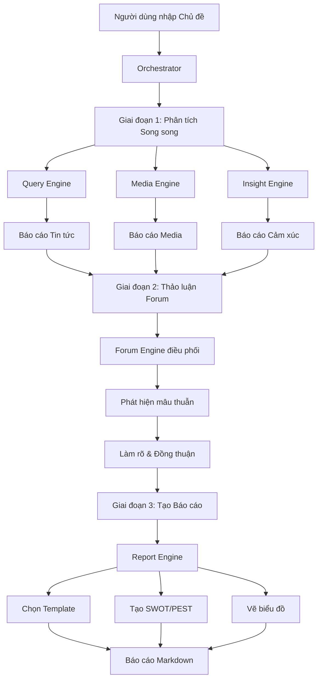

# 🐠 NoLine - Hệ thống Phân tích Dư luận Đa Agent

**NoLine** là một hệ thống phân tích dư luận và tình báo thị trường tiên tiến, sử dụng kiến trúc **Đa Tác nhân (Multi-Agent System)** để mô phỏng quy trình làm việc của một nhóm chuyên gia phân tích thực thụ.

---

## ✨ Tính năng nổi bật

- 🤖 **Đa Agent AI**: 5 chuyên gia AI với vai trò chuyên biệt
- 🔍 **Phân tích đa chiều**: Tin tức, Media, và Cảm xúc xã hội
- 🎤 **Thảo luận tự động**: Các agent tranh luận và bổ sung cho nhau
- 📊 **Báo cáo tự động**: Xuất Markdown với biểu đồ tương tác
- 🧠 **Phân tích SWOT/PEST**: Công cụ phân tích chuyên sâu
- 💾 **Lưu trữ SQLite**: Theo dõi lịch sử phân tích

## 🏗️ Kiến trúc Hệ thống

```
┌─────────────────────────────────────────────────────────────────┐
│                         ORCHESTRATOR                             │
│                    (Điều phối toàn bộ workflow)                  │
└─────────────────────────────────────────────────────────────────┘
                                │
        ┌───────────────────────┼───────────────────────┐
        │                       │                       │
        ▼                       ▼                       ▼
┌───────────────┐     ┌───────────────┐     ┌───────────────┐
│ 🏛️ Query      │     │ 🎨 Media      │     │ 🧠 Insight    │
│    Engine     │     │    Engine     │     │    Engine     │
│               │     │               │     │               │
│ Chuyên gia    │     │ Chuyên gia    │     │ Chuyên gia    │
│ Tin tức       │     │ Đa phương tiện│     │ Tâm lý xã hội │
└───────────────┘     └───────────────┘     └───────────────┘
        │                       │                       │
        └───────────────────────┼───────────────────────┘
                                │
                                ▼
                    ┌───────────────────┐
                    │ 🎤 Forum Engine   │
                    │                   │
                    │ Người điều phối   │
                    │ thảo luận         │
                    └───────────────────┘
                                │
                                ▼
                    ┌───────────────────┐
                    │ 📝 Report Engine  │
                    │                   │
                    │ Tổng biên tập     │
                    │ tạo báo cáo       │
                    └───────────────────┘
                                │
                                ▼
                    ┌───────────────────┐
                    │ 📄 Markdown Report    │
                    └───────────────────┘
```

### 5 Engines chính

| Engine                | Vai trò                 | Nhiệm vụ                                              |
| --------------------- | ----------------------- | ----------------------------------------------------- |
| 🏛️ **Query Engine**   | Nhà báo điều tra        | Tìm kiếm tin tức, xác minh sự thật, xây dựng timeline |
| 🎨 **Media Engine**   | Chuyên gia truyền thông | Phân tích hình ảnh, video, meme, viral content        |
| 🧠 **Insight Engine** | Nhà nghiên cứu dư luận  | Phân tích cảm xúc MXH, slang, tâm lý đám đông         |
| 🎤 **Forum Engine**   | Người điều phối         | Tổ chức thảo luận, phát hiện mâu thuẫn                |
| 📝 **Report Engine**  | Tổng biên tập           | Tổng hợp và tạo báo cáo Markdown                      |

## 📦 Cài đặt

### Yêu cầu hệ thống

- Python 3.11+
- [uv](https://docs.astral.sh/uv/) (khuyến nghị) hoặc pip

## 🔧 Quy trình Hoạt động (Workflow)



## 📊 Mẫu Báo cáo

NoLine tự động chọn mẫu báo cáo phù hợp:

| Mẫu           | Mô tả                 | Use case                     |
| ------------- | --------------------- | ---------------------------- |
| 🔥 Crisis     | Phân tích khủng hoảng | Sự cố, scandal, PR crisis    |
| 🏷️ Brand      | Sức khỏe thương hiệu  | Brand monitoring, perception |
| 📈 Trend      | Xu hướng thị trường   | Market trends, forecasting   |
| 📅 Event      | Tổng hợp sự kiện      | News events, launches        |
| ⚔️ Competitor | Phân tích đối thủ     | Competitive analysis         |
| 🌍 Market     | Tổng quan thị trường  | Market research              |

## 🤝 Đóng góp

Chúng tôi hoan nghênh mọi đóng góp! Xem [CONTRIBUTING.md](CONTRIBUTING.md) để biết thêm chi tiết.

## 🙏 Credits

- Built with ❤️ by NoLine Team

---

<div align="center">

🐠 **NoLine** - Multi-Agent Public Opinion Analysis System

Made ❤️ with 🇻🇳 in Vietnam

</div>
